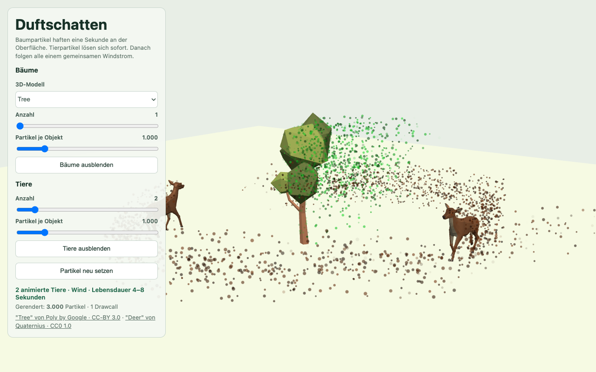
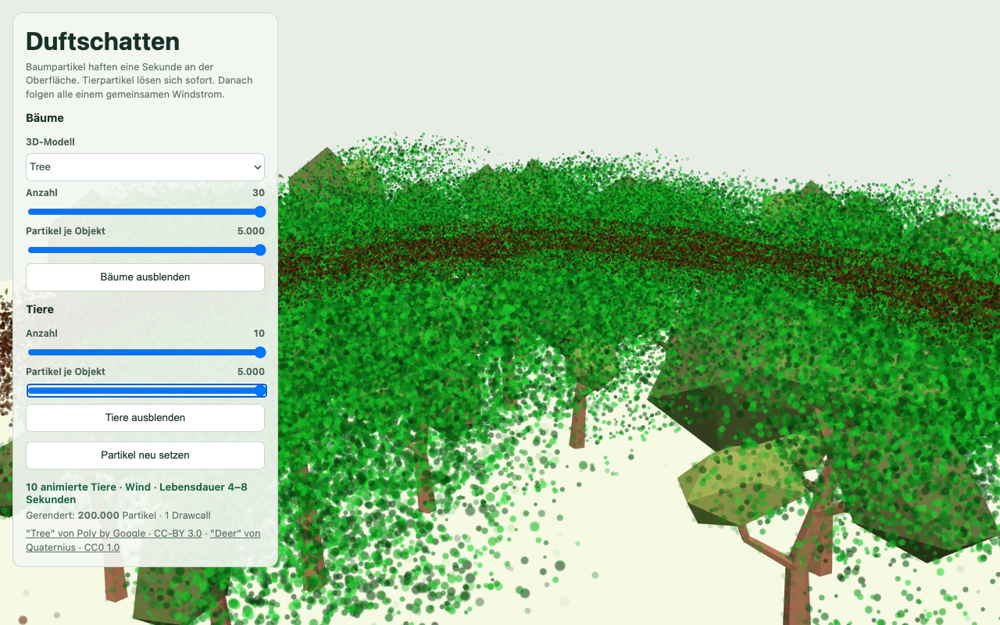

# Scent Particles

A small Three.js reference project for visualizing scent particles emitted by static and moving 3D objects.





## Run

```bash
bun install
bun run dev
```

`bun run build` runs TypeScript checking before the Vite production build.

## Architecture

```text
src/
├── lib/
│   ├── settings.ts
│   ├── scent-particle-system.ts
│   ├── scent-particle.vert.glsl
│   ├── scent-particle.frag.glsl
│   ├── movement-route-atlas.ts
│   ├── ground-route-planner.ts
│   ├── ground-footprints.ts
│   └── model-loader.ts
├── main.ts
├── ui.ts
├── scene.ts
├── tree-group.ts
└── animal-group.ts
```

`src/lib` contains the reusable technical core:

- `settings.ts` defines shared object-group, model, scent, and movement contracts.
- `scent-particle-system.ts` owns the particle buffers, sampling, shader uniforms, and the single `THREE.Points` drawcall.
- `movement-route-atlas.ts` shares route data between CPU object movement and GPU particle attachment.
- `ground-route-planner.ts` creates closed routes around circular ground footprints.
- `model-loader.ts` normalizes GLB models and prepares their render and sampling geometry.

The demo adapters remain explicit. Static trees use `InstancedMesh`; animated animals use independent skeletons. Both expose the same scent-source structure without being forced into a generic runtime manager.

## Contracts

Object groups use one settings shape for models, count limits, scent properties, and behavior. `behavior.kind` distinguishes static placement from ground-route movement.

The particle system accepts two source types:

- `StaticScentSource` provides surface geometry and world transforms.
- `RoutedScentSource` provides surface geometry and route handles.

Routed sources are submitted together with their `MovementRouteAtlas`:

```ts
const scentParticleSystem = new ScentParticleSystem({
  particleCapacity: getMaximumParticleCount(objectGroups),
  pixelRatio,
  wind,
});

scentParticleSystem.resample({
  staticSources,
  routedSources: { routeAtlas, sources: routedSources },
});
```

The caller owns source geometry and route atlases. The particle system only disposes its own geometry, material, and fallback texture.

## Performance

- All scent particles render through one `BufferGeometry`, one `ShaderMaterial`, and one `THREE.Points` drawcall.
- Capacity is allocated once from the configured maximum object and particle counts.
- Particle lifecycle, attachment, wind, color, opacity, and size run in the vertex and fragment shaders.
- Surface sampling and buffer uploads happen only when settings or sources change.
- Static models use instancing; animated models share geometry and materials.
- Animal movement and particle origins read the same precomputed route data.
- Pixel ratio is capped; shadows, post-processing, physics, and per-particle JavaScript updates are omitted.

At the configured maximum of 200,000 particles, the attribute buffers contain approximately 7.8 MB. Transparent particle overdraw can still become more expensive than the particle count itself.

## Limits

- Skinned-model particles sample the normalized base geometry, not the deformed animated mesh.
- Routed movement is limited to upright objects on the XZ plane.
- Route planning is synchronous setup work.
- The prototype has not been performance-tested on physical PICO 4 hardware.
- WebXR integration is intentionally outside this project.

## Assets

The GLB assets come from Poly Pizza. Licenses and source links are documented in [`public/models/ATTRIBUTION.md`](public/models/ATTRIBUTION.md) and displayed in the demo UI.
